```mermaid
graph TD
    D["Discovery<br/>/bob:product-coach · /bob:product-vision · /bob:problem-space<br/>/bob:personas · /bob:business-plan · /bob:positioning · /bob:validation-plan"]
    E["Engineering<br/>/bob:brainstorm → /bob:plan → /bob:review-plan<br/>/bob:implement → /bob:review"]
    K["Knowledge<br/>/bob:document · /bob:guidelines"]

    D -->|grounds| E
    E -->|produces| K
    K -->|guides| E
```

# Bob

AI knows how to write good code. The problem is it rarely does — unless you give it a reason to.

Bob is a set of slash commands for Claude Code that bring discipline to AI-assisted product development — from strategic discovery through shipped, tested, documented code. Each command loads the right principles, reads the right context, follows the right process. Reliably, every time.

**Two independent layers:** Product strategy commands (vision, validation, business model, positioning) and engineering commands (brainstorm, plan, implement, review). Use one, use both, or start where it matters most to you.

Language-agnostic. Platform-agnostic. Works across any stack.

👉 [Homepage](index.html) · [User Guide](docs/user-guide.md) · [Presentation](https://bofrese.github.io/bob/presentation/index.html)

---

## The Problem

Three things that happen when you work with AI without structure:

**AI defaults to average.** It *knows* world-class principles — BDD, DDD, clean architecture. But when you just ask it to solve a problem, it writes like the average programmer it was trained on. Without the right frameworks loaded at the right moment, you get competent code. Not principled code.

**AI is a pleaser.** It agrees with you. Applauds your thinking. Confirms you're right. The longer the conversation, the less likely it pushes back on a bad idea. You need critical distance — and you need it built into the workflow, not hoped for.

**Context disappears.** For an AI, it's day one in your project every session. You know how it feels to join a new project — the guessing, the questions, slowly piecing together why things were built the way they were. For an AI, that's every conversation. New session, new employee. If you have to re-introduce your codebase every time you open Claude, you've already lost the productivity benefit.

Bob solves all three. Deliberately. By design.

---

## Philosophy

This isn't a toolkit that runs commands for you. It's a toolkit that thinks *with* you.

- **Use what you need.** Discovery and Engineering are independent layers. Use Discovery commands for product strategy work. Use Engineering commands for development workflows. Use both together for the full lifecycle. They amplify each other but don't require each other.
- **Explicit commands, not ambient magic.** You invoke `/bob:plan`, `/bob:review`, `/bob:implement` — deliberately, knowingly. When you do, the AI knows exactly what phase you're in. It loads the right principles, reads the right context, follows the right process. No hoping it guesses what you need. You're explicit about what you're doing; the AI is explicit about how it helps.
- **Files are the memory.** Everything persists in git — vision, plans, decisions, guidelines. Context survives across sessions, branches, and people. Close your laptop. Come back tomorrow. Hand off to a colleague. The project remembers.
- **Session boundaries create honesty.** A plan written in one session is reviewed in another — by a fresh context with no memory of the conversation that produced it. That's how you get genuine critique instead of polite agreement.
- **Quality holds up over time.** The tenth feature gets the same disciplined treatment as the first. Guidelines get checked. Principles get applied. Technical debt doesn't silently accumulate.
- **You own the code.** The goal isn't AI that writes code *for* you. It's AI that helps you do better work. You understand every line. You made the decisions. You could walk away from AI entirely and still maintain what you built.

---

## User Guide

The full story — how commands connect, how memory works, how a feature travels from idea to shipped code — is all in one place:

👉 [Read the User Guide](docs/user-guide.md)
👉 [See the Homepage](index.html)
👉 [See the Presentation](https://bofrese.github.io/bob/presentation/index.html)

---

## What Bob Does

Three layers, not three stages. Use any independently or connect them.



**Discovery** — Product strategy and validation: vision, problem space, personas, business model, positioning, validation planning. Start with `/bob:product-coach` for guided discovery, or jump to individual commands for targeted work.

**Engineering** — Disciplined development pipeline: brainstorm → plan → review-plan → implement → review. Each command loads the right principles and follows the right process.

**Knowledge** — Documentation and guidelines that accumulate over time and make future sessions better.

For the full command reference — what each command does, what it reads and writes, how they connect — see the [User Guide](docs/user-guide.md).

---

## Project Knowledge

Bob's value compounds over time because every session writes to a shared, persistent file system. When you open a new session tomorrow, everything from today is already there.

| Location | What lives here |
|---|---|
| `docs/product/` | Strategy artifacts: vision, problem space, personas, business plan, positioning, validation plan, design brief. Maintained by Discovery commands; used by Engineering commands to ground their work. |
| `docs/guidelines/` | Technology best practices — researched from authoritative sources, applied to your stack. Engineering commands load only the guidelines relevant to the work at hand. |
| `docs/domain/` | Project-specific terminology. Corrections, non-obvious distinctions, context-specific meanings. Captured when AI misunderstands something that a domain expert would know. |
| `docs/process/done-criteria.md` | The project's evolving definition of done. Auto-bootstrapped on first run; grows as more commands are used. |
| `ai/` | Session artifacts — plans, reviews, implementations, investigations, brainstorms. The project's decision log. Disposable but valuable: they explain *why* things were built the way they were. |

This is the memory layer. The reason `/bob:review` can check a feature against its plan. The reason `/bob:implement` knows what patterns to follow. The reason a fresh session isn't starting from scratch.

---

## Installation

**User-level** — available across all your projects:

```bash
git clone https://github.com/bofrese/bob.git ~/.claude/plugins/bob
```

**Project-level** — only in the current project:

```bash
git clone https://github.com/bofrese/bob.git .claude/plugins/bob
```

To update later:

```bash
cd ~/.claude/plugins/bob   # or .claude/plugins/bob
git pull
```

### Developing bob

To work on bob itself, clone the repo and pass the directory as a plugin when starting Claude:

```bash
git clone https://github.com/bofrese/bob.git
cd bob
claude --plugin-dir .
```

An alias makes this faster:

```bash
# Add to ~/.zshrc or ~/.bashrc
alias claude-bob='claude --plugin-dir ~/path/to/bob'
```

With the alias, `claude-bob` anywhere opens Claude with your local bob loaded — changes take effect immediately without reinstalling.

---

## Quick Start — Your First Command

After installation, start with `/bob:pm`:

```
/bob:pm
```

**`/bob:pm` is your project mentor** — it assesses where you are, identifies what's missing, and suggests exactly which commands to run next.

**Common starting points:**
- **Product strategy work?** `/bob:product-coach` for comprehensive discovery guidance
- **New feature?** `/bob:brainstorm` → `/bob:plan` → `/bob:implement` → `/bob:review`
- **Inherited codebase?** `/bob:document` to capture what exists
- **Not sure?** `/bob:pm` to get oriented

---

## Contributing

This is a living toolkit — continuously evolving. New commands, sharper existing ones, better patterns. Never finished, and that's by design.

Pull requests are welcome. bob is opinionated, and the opinions are deliberate. A PR might land as-is, get adapted, or get a respectful decline — not because your idea is wrong, but because it doesn't fit the direction. You're welcome to have strong opinions too; that's what makes contributions worth having.

Even if you're not sure a PR will land exactly as written: it's visible. Other people can see it, learn from it, build on it. That has value on its own.

If you use bob, feedback is genuinely useful. What works? What doesn't? What's missing? What surprised you? All of it helps shape where this goes:

👉 [GitHub Discussions](https://github.com/bofrese/bob/discussions)

For guidance on command structure and conventions, see [CLAUDE.md](CLAUDE.md).

---

## License

This project is licensed under the **Apache License 2.0**.

Apache 2.0 means you can use, modify, and distribute this toolkit — commercially or otherwise — for any project. The one thing that must travel with it: the copyright and attribution notice. That's it. No copyleft. No share-alike. No restrictions on what you build with it.

See the [LICENSE](LICENSE) file for the full legal text.

---

## Attribution

Created by **[Bo Frese](https://bofrese.dk)** — [bofrese.dk](https://bofrese.dk)

---

## About the Author

Bo works at the intersection of software development and agile process design — with a particular focus on how teams can integrate AI tools effectively into their workflows without losing the things that make good development good: human judgment, architectural discipline, and the ability to actually understand what you're shipping.

If you're looking for hands-on development help, or if your team wants to think more carefully about how AI fits into your process, Bo is available for both. More at [bofrese.dk](https://bofrese.dk) and [agilecoach.dk](https://agilecoach.dk).
