# dot.claude

AI knows how to write good code. The problem is it rarely does — unless you give it a reason to.

dot.claude is a set of slash commands for Claude Code that bring discipline to AI-assisted development — from first idea through shipped, tested, documented code. Each command loads the right principles, reads the right context, follows the right process. Reliably, every time.

Language-agnostic. Platform-agnostic. Works across any stack.

---

## The Problem

Three things that happen when you work with AI without structure:

**AI defaults to average.** It *knows* world-class principles — BDD, DDD, clean architecture. But when you just ask it to solve a problem, it writes like the average programmer it was trained on. Without the right frameworks loaded at the right moment, you get competent code. Not principled code.

**AI is a pleaser.** It agrees with you. Applauds your thinking. Confirms you're right. The longer the conversation, the less likely it pushes back on a bad idea. You need critical distance — and you need it built into the workflow, not hoped for.

**Context disappears.** New session, start over. Decisions lost. Guidelines forgotten. The AI makes the same mistakes it made last week because it has no memory of last week.

dot.claude solves all three. Deliberately. By design.

---

## Philosophy

This isn't a toolkit that runs commands for you. It's a toolkit that thinks *with* you.

- **Explicit commands, not ambient magic.** You invoke `/plan`, `/review`, `/implement` — deliberately, knowingly. When you do, the AI knows exactly what phase you're in. It loads the right principles, reads the right context, follows the right process. No hoping it guesses what you need. You're explicit about what you're doing; the AI is explicit about how it helps.
- **Files are the memory.** Everything persists in git — vision, plans, decisions, guidelines. Context survives across sessions, branches, and people. Close your laptop. Come back tomorrow. Hand off to a colleague. The project remembers.
- **Session boundaries create honesty.** A plan written in one session is reviewed in another — by a fresh context with no memory of the conversation that produced it. That's how you get genuine critique instead of polite agreement.
- **Quality holds up over time.** The tenth feature gets the same disciplined treatment as the first. Guidelines get checked. Principles get applied. Technical debt doesn't silently accumulate.
- **You own the code.** The goal isn't AI that writes code *for* you. It's AI that helps you do better work. You understand every line. You made the decisions. You could walk away from AI entirely and still maintain what you built.

---

## User Guide

The full story — how commands connect, how memory works, how a feature travels from idea to shipped code — is all in one place:

👉 [Read the User Guide](docs/user-guide.md)  
👉 [See the presentation](https://bofrese.github.io/dot.claude/presentation/index.html)

---

## Commands Overview

All commands follow a coaching style — they work as thinking partners, not just executors. They ask questions, challenge assumptions, and guide you through structured processes.

### Discovery — What to Build and Why

| Command | Purpose | Output |
|---------|---------|--------|
| `/product-vision` | Establish or refine the product vision. The single source of truth for what, who, and why. | `docs/product/vision.md` |
| `/personas` | Define user personas grounded in the product vision. | `docs/product/personas.md` |
| `/design-brief` | Create the design brief from vision and personas. | `docs/product/design-brief.md` |

### Engineering — How to Build It

| Command | Purpose | Output |
|---------|---------|--------|
| `/brainstorm` | Guided ideation for features. Diverge → converge → detail → validate against codebase → commit. | `ai/ideas/{date}-brainstorm-{slug}.md` |
| `/plan` | Turn an idea into a concrete, self-contained implementation plan. | `ai/plans/{date}-{slug}.md` |
| `/review-plan` | Critically review a plan. Checks assumptions against the actual codebase. | `ai/reviews/{date}-review-{slug}.md` |
| `/implement` | Execute an approved plan. Tests at every step. Stops when human judgment is needed. | `ai/implementations/{date}-{slug}.md` |
| `/review` | Code review. Auto-detects scope, checks guidelines, assesses system health. | `ai/reviews/{date}-review-{slug}.md` |

### Knowledge — Documentation & Guidelines

| Command | Purpose | Output |
|---------|---------|--------|
| `/document` | Generate or update developer documentation. Detects doc drift. | `docs/{concept}.md` |
| `/guidelines` | Create and maintain best practice guidelines. Research-first. | `docs/guidelines/{topic}.md` |

### Meta — The Toolkit Maintains Itself

| Command | Purpose | Output |
|---------|---------|--------|
| `/new-command` | Create a new slash command. Guides through design, creates the file, updates README. | `.claude/commands/{name}.md` |
| `/review-command` | Review a command for token efficiency, clarity, actionability. | `ai/reviews/{date}-command-review-{slug}.md` |

### DevOps

| Command | Purpose | Output |
|---------|---------|--------|
| `/docker-setup` | Set up or maintain Docker dev environment. Creates Dockerfile, Makefile, docs. Verifies everything works. | `Dockerfile`, `Makefile`, `docs/install.md`, `ai/docker/{date}-docker-setup.md` |

---

## Workflow

Three layers, not three stages. They form a cycle:

```mermaid
graph TD
    D["Discovery<br/>/product-vision · /personas · /design-brief"]
    E["Engineering<br/>/brainstorm → /plan → /review-plan<br/>/implement → /review"]
    K["Knowledge<br/>/document · /guidelines"]

    D -->|grounds| E
    E -->|produces| K
    K -->|guides| E
```



**Discovery** establishes what you're building and why. **Engineering** turns ideas into reviewed, tested code. **Knowledge** accumulates the wisdom that makes every future session better. Each layer feeds the others.

The `/docker-setup` command stands alone — use it whenever you need to set up or update the dev environment. The `/new-command` and `/review-command` are meta-commands for extending and maintaining the toolkit itself.

---

## Installation

### Option 1: Git Submodule (recommended)

Add as a submodule in your project root:

```bash
git submodule add https://github.com/bofrese/dot.claude.git .claude
```

To update later:

```bash
git submodule update --remote .claude
```

When cloning a project that uses this as a submodule:

```bash
git clone --recurse-submodules <your-project-url>
# or if already cloned:
git submodule init && git submodule update
```

### Option 2: Direct Copy

Copy the contents directly into your project's `.claude/` folder:

```bash
git clone https://github.com/bofrese/dot.claude.git
cp -r dot.claude/commands your-project/.claude/commands
rm -rf dot.claude
```

Or download and extract from GitHub.

### Option 3: User-Level (available in all projects)

Copy to your home directory:

```bash
git clone https://github.com/bofrese/dot.claude.git ~/.claude
```

---

## Context Loading

Commands automatically load relevant context at the start of each session via `process/context.md`. No `CLAUDE.md` configuration needed:

- **Vision** (`docs/product/vision.md`) is loaded by Discovery and Engineering commands if it exists.
- **Guidelines** (`docs/guidelines/`) are loaded by Engineering commands after scope is identified — only the guidelines matching the files and concepts in play. The `/guidelines` command creates and maintains them.

If important decisions emerge during a session, done-criteria will flag them for persistence via `/document`.

---

## Report Locations

| Folder | Contents |
|--------|----------|
| `ai/ideas/` | Brainstorm session reports |
| `ai/plans/` | Implementation plans |
| `ai/reviews/` | Plan reviews, command reviews, and code reviews |
| `ai/implementations/` | Implementation execution reports |
| `ai/docker/` | Docker setup logs |
| `docs/product/` | Product vision, personas, design brief |
| `docs/process/` | Done criteria and process contracts |
| `docs/` | Developer documentation |
| `docs/guidelines/` | Best practice guidelines |

All dated reports use `{YYYY-MM-DD}-{slug}.md` naming.

---

## Contributing

This is a living toolkit — continuously evolving. New commands, sharper existing ones, better patterns. Never finished, and that's by design.

Pull requests are welcome. dot.claude is opinionated, and the opinions are deliberate. A PR might land as-is, get adapted, or get a respectful decline — not because your idea is wrong, but because it doesn't fit the direction. You're welcome to have strong opinions too; that's what makes contributions worth having.

Even if you're not sure a PR will land exactly as written: it's visible. Other people can see it, learn from it, build on it. That has value on its own.

If you use dot.claude, feedback is genuinely useful. What works? What doesn't? What's missing? What surprised you? All of it helps shape where this goes:

👉 [GitHub Discussions](https://github.com/bofrese/dot.claude/discussions)

For guidance on command structure and conventions, see [CLAUDE.md](CLAUDE.md).

---

## License

This project is licensed under the **Apache License 2.0**.

Apache 2.0 means you can use, modify, and distribute this toolkit — commercially or otherwise — for any project. The one thing that must travel with it: the copyright and attribution notice. That's it. No copyleft. No share-alike. No restrictions on what you build with it.

See the [LICENSE](LICENSE) file for the full legal text.

---

## Attribution

Created by **[Bo Frese](https://bofrese.dk)** — [bofrese.dk](https://bofrese.dk)

---

## About the Author

Bo works at the intersection of software development and agile process design — with a particular focus on how teams can integrate AI tools effectively into their workflows without losing the things that make good development good: human judgment, architectural discipline, and the ability to actually understand what you're shipping.

If you're looking for hands-on development help, or if your team wants to think more carefully about how AI fits into your process, Bo is available for both. More at [bofrese.dk](https://bofrese.dk) and [agilecoach.dk](https://agilecoach.dk).
