# dot.claude

A set of slash commands for Claude Code that covers the full product development lifecycle — from first idea through shipped, tested, documented code. Each command works as a thinking partner: it asks questions, challenges assumptions, and guides you through structured decisions. You stay in control. The AI does the heavy lifting.

Language-agnostic, platform-agnostic. Works across any stack.

---

## Philosophy

This isn't a toolkit that runs commands for you. It's a toolkit that thinks *with* you.

- **Coaching, not executing.** Commands guide you through structured thinking, one question at a time. They challenge assumptions and suggest alternatives.
- **Simplicity first.** Always look for the simpler, more generic solution. Code full of exceptions and complex logic means we haven't found the right abstraction.
- **Architectural coherence.** Changes should keep the system clean. No bolted-on features, no legacy fallbacks, no hacks to clean up later.
- **Honest documentation.** Document current state, not aspirations. If something is messy, say so.
- **Standalone outputs.** Reports are complete enough that someone not present for the conversation can pick them up and proceed.

---

## User Guide

The full story — how commands connect, how memory works, how a feature travels from idea to shipped code — is all in one place:

👉 [Read the User Guide](docs/user-guide.md)

---

## Commands Overview

All commands follow a coaching/mentoring style — they work as thinking partners, not just executors. They ask questions, challenge assumptions, and guide you through structured processes.

### Discovery — What to Build and Why

| Command | Purpose | Output |
|---------|---------|--------|
| `/product-vision` | Establish or refine the product vision. The single source of truth for what, who, and why. | `docs/product/vision.md` |
| `/personas` | Define user personas grounded in the product vision. | `docs/product/personas.md` |
| `/design-brief` | Create the design brief from vision and personas. | `docs/product/design-brief.md` |

### Engineering — How to Build It

| Command | Purpose | Output |
|---------|---------|--------|
| `/brainstorm` | Guided ideation for features. Diverge → converge → detail → validate against codebase → commit. | `ai/ideas/{date}-brainstorm-{slug}.md` |
| `/plan` | Turn an idea into a concrete, self-contained implementation plan. | `ai/plans/{date}-{slug}.md` |
| `/review-plan` | Critically review a plan. Checks assumptions against the actual codebase. | `ai/reviews/{date}-review-{slug}.md` |
| `/implement` | Execute an approved plan. Tests at every step. Stops when human judgment is needed. | `ai/implementations/{date}-{slug}.md` |
| `/review` | Code review. Auto-detects scope, checks guidelines, assesses system health. | `ai/reviews/{date}-review-{slug}.md` |

### Knowledge — Documentation & Guidelines

| Command | Purpose | Output |
|---------|---------|--------|
| `/document` | Generate or update developer documentation. Detects doc drift. | `docs/{concept}.md` |
| `/guidelines` | Create and maintain best practice guidelines. Research-first. | `docs/guidelines/{topic}.md` |

### Meta — The Toolkit Maintains Itself

| Command | Purpose | Output |
|---------|---------|--------|
| `/new-command` | Create a new slash command. Guides through design, creates the file, updates README. | `.claude/commands/{name}.md` |
| `/review-command` | Review a command for token efficiency, clarity, actionability. | `ai/reviews/{date}-command-review-{slug}.md` |

### DevOps

| Command | Purpose | Output |
|---------|---------|--------|
| `/docker-setup` | Set up or maintain Docker dev environment. Creates Dockerfile, Makefile, docs. Verifies everything works. | `Dockerfile`, `Makefile`, `docs/install.md`, `ai/docker/{date}-docker-setup.md` |

---

## Workflow

Three layers, not three stages. They form a cycle:

```mermaid
graph TD
    D["Discovery<br/>/product-vision · /personas · /design-brief"]
    E["Engineering<br/>/brainstorm → /plan → /review-plan<br/>/implement → /review"]
    K["Knowledge<br/>/document · /guidelines"]

    D -->|grounds| E
    E -->|produces| K
    K -->|guides| E
```



**Discovery** establishes what you're building and why. **Engineering** turns ideas into reviewed, tested code. **Knowledge** accumulates the wisdom that makes every future session better. Each layer feeds the others.

The `/docker-setup` command stands alone — use it whenever you need to set up or update the dev environment. The `/new-command` and `/review-command` are meta-commands for extending and maintaining the toolkit itself.

---

## Installation

### Option 1: Git Submodule (recommended)

Add as a submodule in your project root:

```bash
git submodule add https://github.com/bofrese/dot.claude.git .claude
```

To update later:

```bash
git submodule update --remote .claude
```

When cloning a project that uses this as a submodule:

```bash
git clone --recurse-submodules <your-project-url>
# or if already cloned:
git submodule init && git submodule update
```

### Option 2: Direct Copy

Copy the contents directly into your project's `.claude/` folder:

```bash
git clone https://github.com/bofrese/dot.claude.git
cp -r dot.claude/commands your-project/.claude/commands
rm -rf dot.claude
```

Or download and extract from GitHub.

### Option 3: User-Level (available in all projects)

Copy to your home directory:

```bash
git clone https://github.com/bofrese/dot.claude.git ~/.claude
```

---

## Guidelines Integration

When using this command set, you can maintain project-specific guidelines in `docs/guidelines/`. The `/guidelines` command helps create and maintain them.

**To enable automatic guideline loading**, add this to your project's `CLAUDE.md`:

```markdown
## Guidelines

Before starting work, check `docs/guidelines/README.md` for applicable guidelines.
Load guidelines that match:
- File extensions you're working with (e.g., `.ts` → typescript.md)
- Paths involved (e.g., `Frontend/` → angular.md)
- Concepts being touched (e.g., login flow → authentication.md)
```

This makes guidelines ambient context for all commands without modifying each command file.

---

## Report Locations

| Folder | Contents |
|--------|----------|
| `ai/ideas/` | Brainstorm session reports |
| `ai/plans/` | Implementation plans |
| `ai/reviews/` | Plan reviews, command reviews, and code reviews |
| `ai/implementations/` | Implementation execution reports |
| `ai/docker/` | Docker setup logs |
| `docs/product/` | Product vision, personas, design brief |
| `docs/process/` | Done criteria and process contracts |
| `docs/` | Developer documentation |
| `docs/guidelines/` | Best practice guidelines |

All dated reports use `{YYYY-MM-DD}-{slug}.md` naming.

---

## Contributing

This is a living toolkit. I use it every day, and it's continuously evolving — new commands, sharper existing ones, better patterns. It's never finished, and that's by design.

Pull requests are welcome — genuinely. dot.claude is opinionated, and the opinions behind it are deliberate. That means a PR might land as-is, get adapted to fit, or get a respectful decline — not because your idea is wrong, but because it doesn't match the direction I'm taking. Please don't take that personally. You're welcome to have strong opinions too; that's what makes contributions worth having.

The reason to open a PR even if you're not sure it'll land exactly as written: it's visible. Other people using dot.claude can see it, learn from it, build on it. That has value on its own.

If you use dot.claude, I'd genuinely love to hear from you. What works well? What doesn't? What's missing? What surprised you — good or bad? All of it is useful, and it all helps shape where this goes next. Come talk about it:

👉 [GitHub Discussions](https://github.com/bofrese/dot.claude/discussions)

For guidance on command structure and conventions, see [CLAUDE.md](CLAUDE.md).

---

## License

This project is licensed under the **Apache License 2.0**.

Apache 2.0 means you can use, modify, and distribute this toolkit — commercially or otherwise — for any project. The one thing that must travel with it: the copyright and attribution notice. That's it. No copyleft. No share-alike. No restrictions on what you build with it.

See the [LICENSE](LICENSE) file for the full legal text.

---

## Attribution

Created by **[Bo Frese](https://bofrese.dk)** — [bofrese.dk](https://bofrese.dk)

---

## About the Author

Bo works at the intersection of software development and agile process design — with a particular focus on how teams can integrate AI tools effectively into their workflows without losing the things that make good development good: human judgment, architectural discipline, and the ability to actually understand what you're shipping.

If you're looking for hands-on development help, or if your team wants to think more carefully about how AI fits into your process, Bo is available for both. More at [bofrese.dk](https://bofrese.dk) and [agilecoach.dk](https://agilecoach.dk).
