# Bob

AI knows how to write good code. The problem is it rarely does — unless you give it a reason to.

Bob is a set of slash commands for Claude Code that bring discipline to AI-assisted product development — from strategic discovery through shipped, tested, documented code. Each command loads the right principles, reads the right context, follows the right process. Reliably, every time.

**Two independent layers:** Product strategy commands (vision, validation, business model, positioning) and engineering commands (brainstorm, plan, implement, review). Use one, use both, or start where it matters most to you.

Language-agnostic. Platform-agnostic. Works across any stack.

---

## The Problem

Three things that happen when you work with AI without structure:

**AI defaults to average.** It *knows* world-class principles — BDD, DDD, clean architecture. But when you just ask it to solve a problem, it writes like the average programmer it was trained on. Without the right frameworks loaded at the right moment, you get competent code. Not principled code.

**AI is a pleaser.** It agrees with you. Applauds your thinking. Confirms you're right. The longer the conversation, the less likely it pushes back on a bad idea. You need critical distance — and you need it built into the workflow, not hoped for.

**Context disappears.** New session, start over. Decisions lost. Guidelines forgotten. The AI makes the same mistakes it made last week because it has no memory of last week.

Bob solves all three. Deliberately. By design.

---

## Philosophy

This isn't a toolkit that runs commands for you. It's a toolkit that thinks *with* you.

- **Use what you need.** Discovery and Engineering are independent layers. Use Discovery commands for product strategy work. Use Engineering commands for development workflows. Use both together for the full lifecycle. They amplify each other but don't require each other.
- **Explicit commands, not ambient magic.** You invoke `/bob:plan`, `/bob:review`, `/bob:implement` — deliberately, knowingly. When you do, the AI knows exactly what phase you're in. It loads the right principles, reads the right context, follows the right process. No hoping it guesses what you need. You're explicit about what you're doing; the AI is explicit about how it helps.
- **Files are the memory.** Everything persists in git — vision, plans, decisions, guidelines. Context survives across sessions, branches, and people. Close your laptop. Come back tomorrow. Hand off to a colleague. The project remembers.
- **Session boundaries create honesty.** A plan written in one session is reviewed in another — by a fresh context with no memory of the conversation that produced it. That's how you get genuine critique instead of polite agreement.
- **Quality holds up over time.** The tenth feature gets the same disciplined treatment as the first. Guidelines get checked. Principles get applied. Technical debt doesn't silently accumulate.
- **You own the code.** The goal isn't AI that writes code *for* you. It's AI that helps you do better work. You understand every line. You made the decisions. You could walk away from AI entirely and still maintain what you built.

---

## User Guide

The full story — how commands connect, how memory works, how a feature travels from idea to shipped code — is all in one place:

👉 [Read the User Guide](docs/user-guide.md)
👉 [See the Presentation](https://bofrese.github.io/bob/presentation/index.html)

---

## Commands Overview

All commands follow a coaching style — they work as thinking partners, not just executors. They ask questions, challenge assumptions, and guide you through structured processes.

### Discovery — What to Build and Why

| Command | Purpose | Output |
|---------|---------|--------|
| `/bob:product-coach` | **Product and business development coach. Guides through comprehensive discovery or targeted sessions. Maintains product docs. (Start here for discovery)** | `docs/product/*` |
| `/bob:product-vision` | Establish or refine the product vision. The single source of truth for what, who, and why. | `docs/product/vision.md` |
| `/bob:problem-space` | Validate and document the problem space before building solutions. | `docs/product/problem-space.md` |
| `/bob:personas` | Define user personas grounded in the product vision. | `docs/product/personas.md` |
| `/bob:business-plan` | Define business model and monetization strategy. Value proposition, unit economics, GTM. | `docs/product/business-plan.md` |
| `/bob:positioning` | Define market positioning, competitive strategy, and go-to-market approach. | `docs/product/positioning.md` |
| `/bob:validation-plan` | Identify assumptions, rank risks, design validation experiments before building. | `docs/product/validation-plan.md` |
| `/bob:design-brief` | Create the design brief from vision and personas. Bridges product intent and implementation. | `docs/product/design-brief.md` |
| `/bob:art-director` | Art direction coaching for product visuals, UI, brand, and marketing materials. | `docs/guidelines/visual-design.md` (optional) |

### Engineering — How to Build It

| Command | Purpose | Output |
|---------|---------|--------|
| `/bob:brainstorm` | Guided ideation for features. Diverge → converge → detail → validate against codebase → commit. | `ai/ideas/{date}-brainstorm-{slug}.md` |
| `/bob:plan` | Turn an idea into a concrete, self-contained implementation plan. | `ai/plans/{date}-{slug}.md` |
| `/bob:review-plan` | Critically review a plan. Checks assumptions against the actual codebase. | `ai/reviews/{date}-review-{slug}.md` |
| `/bob:implement` | Execute an approved plan. Tests at every step. Stops when human judgment is needed. | `ai/implementations/{date}-{slug}.md` |
| `/bob:review` | Code review. Auto-detects scope, checks guidelines, assesses system health. | `ai/reviews/{date}-review-{slug}.md` |
| `/bob:investigate` | Systematic investigation of bugs and issues. Root cause analysis, not quick fixes. | `ai/investigations/{date}-{slug}.md` |

### Knowledge — Documentation & Guidelines

| Command | Purpose | Output |
|---------|---------|--------|
| `/bob:document` | Generate or update developer documentation. Detects doc drift. | `docs/{concept}.md` |
| `/bob:guidelines` | Create and maintain best practice guidelines. Research-first. | `docs/guidelines/{topic}.md` |

### Meta — The Toolkit Maintains Itself

| Command | Purpose | Output |
|---------|---------|--------|
| `/bob:bob` | Project mentor that guides you through the Bob workflow and optimizes session context. | Conversational or `ai/{date}-project-status.md` |
| `/bob:new-command` | Create a new slash command. Guides through design, creates the file, updates README. | `bob/commands/{name}.md` |
| `/bob:review-command` | Review a command for token efficiency, clarity, actionability. | `ai/reviews/{date}-command-review-{slug}.md` |
| `/bob:improve-command` | Extract learnings from a session to improve a command for future use. | `ai/reviews/{date}-improve-{command-name}.md` |

### DevOps

| Command | Purpose | Output |
|---------|---------|--------|
| `/bob:docker-setup` | Set up or maintain Docker dev environment. Creates Dockerfile, Makefile, docs. Verifies everything works. | `Dockerfile`, `Makefile`, `docs/install.md`, `ai/docker/{date}-docker-setup.md` |

---

## Workflow

Three layers, not three stages. They form a cycle. **Use any layer independently or connect them together.**

```mermaid
graph TD
    D["Discovery<br/>/bob:product-coach · /bob:product-vision · /bob:problem-space<br/>/bob:personas · /bob:business-plan · /bob:positioning · /bob:validation-plan"]
    E["Engineering<br/>/bob:brainstorm → /bob:plan → /bob:review-plan<br/>/bob:implement → /bob:review"]
    K["Knowledge<br/>/bob:document · /bob:guidelines"]

    D -->|grounds| E
    E -->|produces| K
    K -->|guides| E
```



**Discovery** (optional) — Product strategy and validation. Vision, problem validation, business model, market positioning, validation planning. Start with `/bob:product-coach` for comprehensive guidance through the full discovery process, or jump to specific commands for targeted work. The coach maintains `docs/product/README.md` to track progress and gaps. **Works standalone** — use these for pure strategy work without writing any code.

**Engineering** — Disciplined development pipeline. Brainstorm → Plan → Review Plan → Implement → Review. Each command loads the right principles, follows the right process. If Discovery artifacts exist, they ground the work. If not, Engineering commands work fine without them. **Works standalone** — use these for better development workflows without doing formal Discovery.

**Knowledge** — Documentation and guidelines that accumulate over time. Every Engineering session can feed back into docs and guidelines, making future sessions better.

**Discovery Flow:** Start with `/bob:product-coach` for comprehensive guidance, or use individual commands (`/bob:product-vision`, `/bob:problem-space`, `/bob:business-plan`, etc.) for targeted work. The coach maintains `docs/product/README.md` to track what's done and what's missing.

**Commands outside the main flow:**
- `/bob:bob` — Your project mentor. Use it anytime to get oriented, identify gaps, and get guidance on what to do next.
- `/bob:docker-setup` — Use whenever you need to set up or update the dev environment.
- `/bob:new-command`, `/bob:review-command`, `/bob:improve-command` — Meta-commands for extending and maintaining the toolkit itself.

---

## Installation

**User-level** — available across all your projects:

```bash
git clone https://github.com/bofrese/bob.git ~/.claude/plugins/bob
```

**Project-level** — only in the current project:

```bash
git clone https://github.com/bofrese/bob.git .claude/plugins/bob
```

To update later:

```bash
cd ~/.claude/plugins/bob   # or .claude/plugins/bob
git pull
```

### Developing bob

To work on bob itself, clone the repo and pass the directory as a plugin when starting Claude:

```bash
git clone https://github.com/bofrese/bob.git
cd bob
claude --plugin-dir .
```

An alias makes this faster:

```bash
# Add to ~/.zshrc or ~/.bashrc
alias claude-bob='claude --plugin-dir ~/path/to/bob'
```

With the alias, `claude-bob` anywhere opens Claude with your local bob loaded — changes take effect immediately without reinstalling.

---

## Quick Start — Your First Command

After installation, start with `/bob:bob`:

```
/bob:bob
```

**`/bob:bob` is your project mentor** — it assesses where you are, identifies what's missing, and suggests exactly which commands to run next.

New to bob? `/bob:bob` will guide you through the workflow step by step, explaining why each command matters. Already working on a project? `/bob:bob` identifies gaps (missing docs, unreviewed plans, patterns that should be captured) and recommends specific next steps.

**Common starting points:**
- **Product strategy work?** Run `/bob:product-coach` for comprehensive discovery guidance
- **Just better development?** Run `/bob:brainstorm` for your first feature
- **Inherited codebase?** Run `/bob:document` to capture what exists

Think of `/bob:bob` as the command that teaches you how to use all the other commands. Start there whenever you're unsure what to do next.

---

## Context Loading

Commands automatically load relevant context at the start of each session via the `bob:context-protocol` skill. No `CLAUDE.md` configuration needed:

- **Vision** (`docs/product/vision.md`) is loaded by Discovery and Engineering commands if it exists.
- **Guidelines** (`docs/guidelines/`) are loaded by Engineering commands after scope is identified — only the guidelines matching the files and concepts in play. The `/bob:guidelines` command creates and maintains them.

If important decisions emerge during a session, done-criteria will flag them for persistence via `/bob:document`.

---

## Report Locations

| Folder | Contents |
|--------|----------|
| `ai/ideas/` | Brainstorm session reports |
| `ai/plans/` | Implementation plans |
| `ai/reviews/` | Plan reviews, command reviews, code reviews, and command improvement reports |
| `ai/implementations/` | Implementation execution reports |
| `ai/investigations/` | Bug and issue investigation reports |
| `ai/docker/` | Docker setup logs |
| `ai/` | Project status reports from `/bob:bob` (optional) |
| `docs/product/` | Product vision, problem space, personas, business plan, positioning, validation plan, design brief. `README.md` (maintained by `/bob:product-coach`) tracks status and gaps. |
| `docs/process/` | Done criteria and process contracts |
| `docs/` | Developer documentation |
| `docs/guidelines/` | Best practice guidelines (including visual-design from `/bob:art-director`) |

All dated reports use `{YYYY-MM-DD}-{slug}.md` naming.

---

## Contributing

This is a living toolkit — continuously evolving. New commands, sharper existing ones, better patterns. Never finished, and that's by design.

Pull requests are welcome. bob is opinionated, and the opinions are deliberate. A PR might land as-is, get adapted, or get a respectful decline — not because your idea is wrong, but because it doesn't fit the direction. You're welcome to have strong opinions too; that's what makes contributions worth having.

Even if you're not sure a PR will land exactly as written: it's visible. Other people can see it, learn from it, build on it. That has value on its own.

If you use bob, feedback is genuinely useful. What works? What doesn't? What's missing? What surprised you? All of it helps shape where this goes:

👉 [GitHub Discussions](https://github.com/bofrese/bob/discussions)

For guidance on command structure and conventions, see [CLAUDE.md](CLAUDE.md).

---

## License

This project is licensed under the **Apache License 2.0**.

Apache 2.0 means you can use, modify, and distribute this toolkit — commercially or otherwise — for any project. The one thing that must travel with it: the copyright and attribution notice. That's it. No copyleft. No share-alike. No restrictions on what you build with it.

See the [LICENSE](LICENSE) file for the full legal text.

---

## Attribution

Created by **[Bo Frese](https://bofrese.dk)** — [bofrese.dk](https://bofrese.dk)

---

## About the Author

Bo works at the intersection of software development and agile process design — with a particular focus on how teams can integrate AI tools effectively into their workflows without losing the things that make good development good: human judgment, architectural discipline, and the ability to actually understand what you're shipping.

If you're looking for hands-on development help, or if your team wants to think more carefully about how AI fits into your process, Bo is available for both. More at [bofrese.dk](https://bofrese.dk) and [agilecoach.dk](https://agilecoach.dk).
