# dot.claude

## AI-Assisted Product Development — From First Idea to Shipped Code

*A language-agnostic toolkit for structured, reproducible, human-in-the-loop development. Works with any stack: TypeScript, PHP, Python, Rust, Go — whatever you're building with.*

---

## Why This Exists

Most developers who work regularly with AI hit the same three walls.

**AI defaults to average.** It *knows* world-class principles — BDD, DDD, clean architecture. But when you just ask it to solve a problem, it defaults to the patterns most common in its training data. Competent code. Rarely principled code. The knowledge is there. The discipline to apply it isn't — not without help.

**AI is a pleaser.** It agrees with you. The longer your conversation goes, the less likely it pushes back on a bad idea. You open a session expecting a thinking partner. You get an enthusiastic yes-person. And the quality of your decisions suffers for it.

**Context disappears.** New session, start over. Decisions lost. Guidelines forgotten. Next week the AI makes the same mistake it made this week — because it has no memory of this week. Projects that start well degrade quietly as context accumulates and vanishes.

These aren't edge cases. They're the default. And they compound — the longer you work with AI without structure, the worse they get.

dot.claude is the structure. A set of slash commands that turn AI-assisted development into a disciplined process — one where each phase has its own command, each command loads the right principles and reads the right context, and each step produces a clear artifact that the next step builds on. The AI does the heavy lifting. You make the decisions. The files remember everything.

---

## Use What You Need

dot.claude has two independent layers:

**Discovery** — Product strategy and validation. Vision, personas, business model, positioning, validation planning. Use these if you're figuring out *what* to build and *why*. Perfect for founders, product people, or anyone thinking through strategy. Works standalone — no code required.

**Engineering** — Disciplined development workflows. Brainstorm, plan, implement, review, document, test. Use these if you're building software and want AI assistance that maintains quality over time. Works standalone — no Discovery required, though it's better when grounded in a vision.

Use one, use both, or start with whichever fits your current need. They're designed to connect but don't depend on each other. Discovery artifacts (when they exist) automatically feed into Engineering workflows to ground decisions. But if you just want better development workflows, start with `/brainstorm` and ignore Discovery entirely.

---

## The Philosophy

Four ideas that everything else is built on:

### 🎯 Human decides, AI explores
Every command is a conversation, not a script. The AI generates options, challenges your assumptions, surfaces trade-offs you haven't thought of. You pick the direction. Nothing ships without your sign-off. This isn't automation — it's amplification. And it means the code is yours: you understand it, you made the decisions, you could maintain it without AI if you had to.

### ⚡ Explicit commands, not ambient magic
You invoke `/plan`, `/review`, `/implement` — deliberately, knowingly. When you do, the AI knows exactly what phase you're in. It loads the right principles, reads the right context, follows the right process — reliably, every time. No hoping it guesses what you need. You're explicit about what you're doing; the AI is explicit about how it helps. This is discipline, not magic.

### 📄 Files are the memory
Each command is designed to run in its own session. This way you keep your context clean and focused. When it finishes, it writes its output to a well-known file location. The next command reads that file. You can close your laptop, come back tomorrow, hand off to a colleague, or start completely fresh — the context lives in the files, not in the chat history.

This is also what makes honest review possible. A plan written in one session is reviewed in another — by a fresh context with no memory of the conversation that produced it. Session boundaries kill the pleaser instinct. You get genuine critique instead of polite agreement.

### 🌱 The system learns as you use it
The first time you run certain commands, they register what they've created into a shared process contract. From that point on, every command knows what needs to stay in sync. The toolkit gets smarter as your project grows. Nothing to configure upfront.

---

## The Big Picture

A product starts as an idea and ends as running code. Between those two points there's a lot of thinking, deciding, planning, building, checking, and documenting. dot.claude has a command for each phase — and they're designed to flow into each other.

```mermaid
flowchart TD
    subgraph Discovery["💡 Discovery — What and Why"]
        PV["/product-vision"] --> PA["/personas"]
        PV --> DB["/design-brief"]
    end
    subgraph Engineering["⚙️ Engineering — How"]
        BS["/brainstorm"] --> PL["/plan"]
        PL --> RP["/review-plan"]
        RP --> IM["/implement"]
        IM --> RV["/review"]
    end
    subgraph Knowledge["📚 Knowledge — How Well"]
        DC["/document"] -.->|"enriches"| GL["/guidelines"]
    end
    Discovery -->|"grounds"| BS
    RV -->|"feeds"| DC
    GL -->|"guides"| BS
```



Three layers, not three stages. **Discovery** establishes what you're building and why. **Engineering** is the pipeline that turns ideas into code. **Knowledge** is the accumulated wisdom — guidelines, documentation, best practices — that makes every future session better. They form a cycle, not a line.

---

## How Memory Works

This is the key insight. Everything else follows from it.

Files live in three places, each with a distinct purpose:

```mermaid
flowchart TD
    subgraph Toolkit[".claude/ — The Toolkit 🛠️"]
        CMD["commands/"]
        PRI["principles/"]
        PRO["process/"]
    end
    Toolkit -->|"writes session artifacts"| Working
    Toolkit -->|"writes authoritative docs"| Permanent
    subgraph Working["ai/ — Working Memory 🗒️ Disposable"]
        W1["ideas/"]
        W2["plans/"]
        W3["reviews/"]
        W4["implementations/"]
    end
    subgraph Permanent["docs/ — Project Memory 📖 Authoritative"]
        P1["product/"]
        P2["process/"]
        P3["guidelines/"]
        P4["architecture docs"]
    end
```



**`.claude/`** is the toolkit. A git submodule — drop it into any project and it works. It knows nothing about your specific product. Generic. Reusable. Shared across projects.

**`ai/`** is working memory. Session logs, thinking traces, the scratchpad. Useful while you're actively developing a feature. Disposable — you could delete this entire folder and your project would still function perfectly. These are not the important files.

**`docs/`** is the project's memory. Authoritative. Committed. This is what a new developer reads on day one. What matters whether or not you ever use AI tools. Product vision, design briefs, personas, architecture docs, guidelines — all of it lives here permanently.

The distinction is deliberate. It means you always know what's important and what's temporary.

Commands bridge these spaces automatically. At the start of each session, `context.md` tells them what to load — vision for Discovery and Engineering commands, relevant guidelines for Engineering commands once scope is clear. Nothing to configure. The files are the memory; the commands know where to look.

---

## A Real Journey

Let's see what this actually looks like. You have a new feature idea. Let's take it from spark to shipped code.

### Monday morning — "We should let users set notification preferences"

The idea is vague but feels important. You sit down with coffee.

```
/brainstorm
```

The AI reads your product vision to ground the conversation and loads DDD principles to decompose the problem space. Then it asks: *What's the actual problem here? Who's affected? What have users said?* You talk it through. It pushes back — *"Do users actually want granular controls, or do they just want it to stop annoying them? Those are very different features."* Good question. You hadn't thought about that. You explore options together. You pick a direction and commit.

**What gets saved:** `ai/ideas/2026-02-04-brainstorm-notification-prefs.md`

A complete record of what you discussed, what you considered, what you decided, and why. Close the laptop. The session is done.

---

### Tuesday — Turn it into a plan

New session. Fresh context. You point it at yesterday's brainstorm.

```
/plan ai/ideas/2026-02-04-brainstorm-notification-prefs.md
```

The AI reads the report. It examines the codebase — where does notification logic currently live? What patterns are in use? It loads BDD principles to think about how this should be tested *before* it thinks about how it should be built. It walks you through the approach, one question at a time. You push back on one thing, agree on the rest.

**What gets saved:** `ai/plans/2026-02-04-notification-prefs.md`

A self-contained plan. Someone who wasn't in either conversation could pick this up and implement it. Close the laptop.

---

### Wednesday morning — Stress-test the plan

```
/review-plan ai/plans/2026-02-04-notification-prefs.md
```

A different lens on the same plan. The AI re-reads the codebase *independently* — it doesn't trust the plan's assumptions. This is the session boundary doing its job: a fresh context has no investment in the plan being right. It checks for security issues, unnecessary complexity, gaps. It finds something: *"The plan assumes notification preferences are stored per-user, but the current schema stores them per-device. This needs addressing before implementation."*

Glad someone caught that. You update the plan accordingly. Close the laptop.

---

### Wednesday afternoon — Build it

```
/implement ai/plans/2026-02-04-notification-prefs.md
```

The AI reads the approved plan. Runs the test suite first — establishes a green baseline before touching anything. Then it implements step by step, running tests after each change. It loads BDD principles when writing tests — Given/When/Then, behaviour not implementation. If it hits something the plan didn't anticipate, it stops and asks you. If it spots a small improvement along the way, it makes it and notes it in the report.

**What gets saved:** Modified code + `ai/implementations/2026-02-04-notification-prefs.md`

Tests pass. Code is clean. Close the laptop.

---

### Thursday — Review what was built

```
/review
```

The AI detects what changed — git diff, branch comparison. It reads the plan to compare intent vs. reality. It loads the project's guidelines and checks the code against them. It walks you through findings one at a time. A couple of small things to tighten up. You fix them. The review report is a handoff document — anyone can read it and confidently own this code.

**What gets saved:** `ai/reviews/2026-02-04-review-notification-prefs.md`

---

### Friday — Document it

```
/document
```

The AI looks at what changed and what's not documented. It writes clear, honest documentation — the *why* and *what*, not a line-by-line walkthrough of the code. It updates the docs index. It checks whether existing docs have drifted while you were busy building.

**What gets saved:** Updated files in `docs/`

---

Five sessions. Five days. One feature, from idea to shipped code. Each session independent. Each one building on the last through files. A human made every significant decision. The AI did the heavy lifting. And the done-criteria contract verified that nothing was forgotten at the end of each step.

Do it again next week with a different feature. And the week after. The tenth feature gets the same disciplined treatment as the first. That's what sustainable quality looks like.

---

## The Commands

### 💡 Discovery — What to Build and Why

**These commands are completely optional.** You can use dot.claude purely for engineering workflows (brainstorm → plan → implement → review) without ever touching Discovery. Or use Discovery to design and validate your product strategy without implementing any code. Or use both together. They're independent layers that work better when connected.

Discovery commands produce product artifacts that answer strategic questions: What are we building? Who is it for? Why does it matter? Is the problem real? How will we make money? How will we win in the market? Their output lives in `docs/product/` — authoritative documents that ground all future work, whether done by humans or AI.

**Start with `/product-coach`** if you want comprehensive guidance through the discovery process. It's a world-class product and business coach that guides you through validation, helps you think through hard questions, and maintains all your product documentation. It works in multiple modes:
- **Comprehensive discovery** — guides you through the full process from vision to validation plan
- **Targeted sessions** — work on specific areas (business model, positioning, etc.)
- **Gap analysis** — reviews what exists and recommends what's missing
- **Maintenance** — keeps existing docs current and consistent

Or jump directly to individual commands if you know exactly what you need.

---

#### `/product-coach`
Product and business development coach. Your primary guide through comprehensive discovery or targeted product strategy work. Maintains `docs/product/README.md` as a navigation layer showing what exists and what's missing.

| | |
|---|---|
| **Reads** | All existing `docs/product/` artifacts |
| **Writes** | Any/all product docs based on mode, maintains `docs/product/README.md` |
| **Start here when** | You want guidance through discovery, gap analysis, or doc maintenance |

#### `/product-vision`
Establish or refine your product vision. The single source of truth for *what* you're building, *who* it's for, and *why*. Has two modes: create from scratch, or revisit and update an existing vision.

| | |
|---|---|
| **Reads** | Existing `docs/product/vision.md` (if updating) |
| **Writes** | `docs/product/vision.md` |
| **Start here when** | Beginning a new product, or the direction needs revisiting |

#### `/problem-space`
Validate and document the problem space before building solutions. Is this problem real? Painful enough? Worth solving? Helps you avoid building solutions looking for problems.

| | |
|---|---|
| **Reads** | `docs/product/vision.md` |
| **Writes** | `docs/product/problem-space.md` |
| **Start here when** | After vision, before committing resources to building |

#### `/personas`
Define the people you're building for. Not demographics on a slide — real characters with real problems, real behaviours, and real frustrations. Grounded in your product vision.

| | |
|---|---|
| **Reads** | `docs/product/vision.md` |
| **Writes** | `docs/product/personas.md` |
| **Start here when** | After vision is established, before design work begins |

#### `/business-plan`
Define business model and monetization strategy. Uses value proposition frameworks to articulate how the product creates and captures value. Unit economics, pricing, revenue model.

| | |
|---|---|
| **Reads** | `docs/product/vision.md`, `docs/product/personas.md` |
| **Writes** | `docs/product/business-plan.md` |
| **Start here when** | After vision is established and you need to define the business model |

#### `/positioning`
Define market positioning, competitive strategy, and go-to-market approach. How you win in your market, how you differentiate, how you reach customers.

| | |
|---|---|
| **Reads** | `docs/product/vision.md`, `docs/product/business-plan.md` (if exists) |
| **Writes** | `docs/product/positioning.md` |
| **Start here when** | After business model is clear and you need GTM strategy |

#### `/validation-plan`
Identify assumptions, rank risks, and design validation experiments before building. What are you betting on? How will you test those bets? Reduces risk of building the wrong thing.

| | |
|---|---|
| **Reads** | All existing product docs |
| **Writes** | `docs/product/validation-plan.md` |
| **Start here when** | After strategy is defined, before major resource commitment |

#### `/design-brief`
Create the design brief — the visual direction, interaction patterns, tone, and feel of the product. Informed by who you're building for and what they need.

| | |
|---|---|
| **Reads** | `docs/product/vision.md`, `docs/product/personas.md` |
| **Writes** | `docs/product/design-brief.md` |
| **Start here when** | After vision and personas are in place |

#### `/art-director`
Art direction coaching for product visuals, UI, brand, and marketing materials. Works as a creative partner to develop visual identity and design language.

| | |
|---|---|
| **Reads** | `docs/product/vision.md`, `docs/product/design-brief.md` (if exists) |
| **Writes** | `docs/guidelines/visual-design.md` (optional), conversational guidance |
| **Start here when** | You need visual design direction or creative coaching |

---

### ⚙️ Engineering

The core pipeline. Each command's output is designed to be useful input to the next. This is where most of your time will be spent.

#### `/brainstorm`
Structured ideation for a specific feature or problem. The AI guides you through four phases: **Diverge** (explore options and alternatives), **Converge** (pick a direction based on clear criteria), **Detail** (flesh out the chosen approach), **Validate** (check it actually fits the codebase). Loads DDD principles when decomposing the problem — bounded contexts, domain language, the works.

| | |
|---|---|
| **Reads** | `docs/product/vision.md` (if present), `.claude/principles/ddd.md` |
| **Writes** | `ai/ideas/{date}-brainstorm-{slug}.md` |
| **Start here when** | You have an idea and want to think it through properly |

#### `/plan`
Turn a brainstorm — or any idea — into a concrete, reviewable implementation plan. The plan is self-contained: someone who wasn't in the brainstorm conversation could pick it up and execute it. Loads BDD principles when defining the test strategy — tests are planned *before* code is written.

| | |
|---|---|
| **Reads** | Brainstorm report, `docs/guidelines/`, `.claude/principles/bdd.md` |
| **Writes** | `ai/plans/{date}-{slug}.md` |
| **Start here when** | After brainstorm. Before any code is written. |

#### `/review-plan`
Independent critical review of a plan. This command doesn't trust the plan's assumptions — it re-reads the actual codebase and checks whether the plan's description of reality matches reality. Looks for over-engineering, security gaps, simpler alternatives the plan missed. Constructively skeptical by design.

| | |
|---|---|
| **Reads** | The plan file + the actual codebase |
| **Writes** | `ai/reviews/{date}-review-{slug}.md` |
| **Start here when** | After plan is written. Before implementation begins. |

#### `/implement`
Execute an approved plan. Runs the full test suite before touching anything — no implementation on a broken baseline. Implements step by step, running tests after each change. Loads BDD principles when writing tests. Stops when it hits something that needs a human call. Notes discoveries and small improvements in its report.

| | |
|---|---|
| **Reads** | The approved plan, `.claude/principles/bdd.md` |
| **Writes** | Modified code + `ai/implementations/{date}-{slug}.md` |
| **Start here when** | Plan is reviewed and approved. |

#### `/review`
Code review of what was built. Auto-detects scope from git — uncommitted changes, branch commits, or a specific range. Loads applicable guidelines and checks the code against them. Assesses system health: is the codebase still clean after these changes? Produces a handoff document that lets anyone take ownership confidently.

| | |
|---|---|
| **Reads** | Changed files, the plan (if one exists), applicable guidelines |
| **Writes** | `ai/reviews/{date}-review-{slug}.md` |
| **Start here when** | After implementation. Before merging. |

#### `/investigate`
Systematic investigation of bugs and issues. Root cause analysis, not quick fixes. Explores the problem thoroughly, identifies contributing factors, and produces a clear diagnosis that can inform a proper solution.

| | |
|---|---|
| **Reads** | Relevant codebase, error logs, related code |
| **Writes** | `ai/investigations/{date}-{slug}.md` |
| **Start here when** | You have a bug or issue that needs proper diagnosis before fixing |

---

### 📚 Knowledge

These commands build and maintain the shared knowledge base that makes every future session better.

#### `/document`
Generate or update developer documentation. Two modes: **new** (write docs for something that isn't documented yet) and **maintenance** (detect drift — find where docs and code have gone out of sync and fix it). Documentation is a navigation layer: the *why* and *what*, not a line-by-line reference.

| | |
|---|---|
| **Reads** | The codebase, existing docs |
| **Writes** | `docs/{concept}.md`, updates `docs/README.md` |
| **Start here when** | After new features ship. Periodically, to catch drift. |

#### `/guidelines`
Create best-practice guidelines for the technologies in your project. Research-first: it looks at official style guides, security standards, and tooling recommendations *before* it looks at your code. The result is something that elevates code quality automatically — both yours and the AI's.

| | |
|---|---|
| **Reads** | External authoritative sources, then the codebase |
| **Writes** | `docs/guidelines/{topic}.md` |
| **Start here when** | Setting up a new project. Adopting a new technology. |

---

### 🛠️ Meta — The Toolkit Maintains Itself

#### `/dot`
Project mentor that guides you through the dot.claude workflow. Assesses project state, identifies gaps, recommends next steps, and helps optimize session context. Your go-to command when you're unsure what to do next or how to structure your work.

| | |
|---|---|
| **Reads** | Project structure, existing artifacts, recent work |
| **Writes** | `ai/{date}-project-status.md` (optional status report mode) |
| **Start here when** | You're new to dot.claude, unsure what to do next, or starting a new session |

#### `/new-command`
Create a new slash command that fits the existing patterns. Guides you through design, creates the file, updates the README. Use this when the toolkit is missing something your workflow needs.

#### `/review-command`
Optimize an existing command for token efficiency and clarity. Finds bloat, ambiguity, missing guardrails. Proposes a leaner version. Use this when a command feels slow or produces inconsistent results.

#### `/improve-command`
Extract learnings from a completed session to improve a command for future use. Analyzes what worked, what didn't, and proposes specific improvements to command design, process, or output format.

| | |
|---|---|
| **Reads** | Session history, command file, outputs produced |
| **Writes** | `ai/reviews/{date}-improve-{command-name}.md` |
| **Start here when** | After using a command and identifying ways it could work better |

---

### 🚀 DevOps

#### `/docker-setup`
Set up or update a Docker development environment. Creates Dockerfile, Makefile, install docs. Verifies everything actually works before it's done.

| | |
|---|---|
| **Reads** | Project structure, dependencies |
| **Writes** | `Dockerfile`, `Makefile`, `docs/install.md`, `ai/docker/{date}-docker-setup.md` |
| **Start here when** | Setting up containerized development environment |

---

## The Supporting Systems

Three systems underneath the commands that make them consistent, disciplined, and self-improving.

### Principles — How to Think

```mermaid
flowchart TD
    subgraph Generic[".claude/principles/ — generic, travels with toolkit"]
        BDD["bdd.md — Given/When/Then"]
        DDD["ddd.md — Bounded contexts"]
    end
    Generic -->|"foundations for"| Specific
    subgraph Specific["docs/guidelines/ — specific to your project"]
        G1["typescript.md"]
        G2["angular.md"]
        G3["php.md"]
    end
```



**Principles** are small, focused files — 20-40 lines each. They encode thinking frameworks that commands load on demand when relevant. `/plan` loads BDD when writing a test strategy. `/brainstorm` loads DDD when decomposing a problem. They're not loaded into every session — only when the command actually needs them. They travel with the submodule and work for any project.

**Guidelines** are project-specific. They say *how* to apply those principles in your particular codebase. They're created by `/guidelines`, checked by `/review`, and loaded by commands that need them.

### Done Criteria — The Contract That Grows


The done-criteria system is how the toolkit remembers what needs to stay in sync. There are two files with the same name in different places:

- **`.claude/process/done-criteria.md`** — the protocol. Contains the bootstrap template and the rules for how commands interact with the system. Single source of truth. Travels with the submodule.
- **`docs/process/done-criteria.md`** — the live project instance. The actual READY and DONE criteria for your project. Grows as you use more commands.

Commands don't each carry their own copy of the logic. They load the protocol with one line, and it tells them everything: bootstrap if the project file doesn't exist, check criteria before finishing, register new artifact types if they introduce one. The contract grows organically. Nothing to configure.

### How It Grows Over Time

```mermaid
sequenceDiagram
    participant Y as You
    participant C as Commands
    participant D as Done Criteria

    Y->>C: /plan → /implement
    C->>D: Register: tests must pass
    C->>D: Register: plans self-contained

    Y->>C: /document first time
    C->>D: Register: docs stay in sync

    Y->>C: /guidelines first time
    C->>D: Register: follow guidelines

    Note over Y,D: Months later...
    Y->>C: /implement
    C->>D: tests ✓ docs ✓ guidelines ✓
    C->>Y: All criteria met. Ship it.
```



The first time you run a feature through the pipeline, the done-criteria contract is mostly empty. By the fourth or fifth feature, it's a comprehensive checklist that every command verifies automatically. Nothing slips through the cracks. The system earned that checklist — it wasn't written by hand upfront.

---

## Getting Started

### New to dot.claude? Start with `/dot`

Before diving into individual commands, meet your guide: **`/dot`** — your project mentor.

Think of `/dot` as your personal coach who understands the entire dot.claude system. Run it anytime to:

- **Get oriented** — What's the current state of your project? What foundational work exists?
- **Identify gaps** — What's missing? What needs attention?
- **Get specific guidance** — Which command should you run next and why?
- **Optimize context** — Starting a new session? `/dot` tells you exactly what to load and what to skip.

**Try it now:**
```
/dot
```

It will assess where you are, what you're missing, and suggest concrete next steps with specific commands. As you work through the toolkit, come back to `/dot` whenever you're unsure what to do next. It's designed to teach you the workflow through use.

New projects start with `/product-vision`, but `/dot` will tell you that — and explain why it matters.

---

### 1. Add the toolkit

```bash
# Recommended: as a git submodule (stays up to date across projects)
git submodule add https://github.com/bofrese/dot.claude.git .claude

# Alternative: copy directly
git clone https://github.com/bofrese/dot.claude.git
cp -r dot.claude/commands  your-project/.claude/commands
cp -r dot.claude/principles your-project/.claude/principles
cp -r dot.claude/process    your-project/.claude/process
rm -rf dot.claude
```

### 2. Set up guidelines (optional but recommended)

```
/guidelines
```

Scans your project, identifies the technologies, and helps you create best-practice guidelines. Start with whichever language or framework matters most to your project.

Once created, guidelines load automatically when Engineering commands work in relevant areas — no extra configuration needed.

### 3. Let `/dot` guide you (or pick your own entry point)

Not sure where to start? Just run `/dot` — it will assess your project and tell you exactly what to do first.

If you prefer to jump in directly:

**Brand new product from scratch?** Start with `/product-coach` for comprehensive discovery — it'll guide you through vision, validation, business model, and more. Or jump to `/product-vision` if you just want to establish strategic direction.

**Want product strategy help without writing code?** Use the Discovery commands (`/product-coach`, `/product-vision`, `/problem-space`, `/business-plan`, `/positioning`) independently. dot.claude works as a pure product strategy toolkit if that's all you need.

**Want to skip Discovery and just build better?** Start with `/brainstorm` for your first feature. Engineering commands work standalone — they'll just work better if you have a vision to ground them.

**Existing product, new feature idea?** Start with `/brainstorm`.

**Someone handed you a plan to implement?** Go straight to `/review-plan`, then `/implement`.

**Inherited a codebase with no docs?** Start with `/document`.

There's no wrong place to start. Commands read what's available and work with what they find. If a product vision doesn't exist yet, `/brainstorm` simply won't try to read one. But `/dot` will recommend the optimal path based on what you actually have.

---

## The Rules of the Road

A few things worth internalising. They're what make this work in practice.

**The output is a discussion starter, not a final answer.** This is the most important one. When a command produces a report — a brainstorm, a plan, a review — that document is the AI's *first draft* based on everything it knows. It's not gospel. It's an invitation to dig in. The AI has done the groundwork: it's read the codebase, thought through the options, made reasonable assumptions. Now *you* engage with it. Push back. Ask "why did you choose this?" Ask "what if we did it this way instead?" The AI has the full context of the session still live — use it. Iterate together until the document is something *you* are genuinely happy with. Then ask it to update the file. **You own the output. The AI drafted it.**

**One session per phase.** Don't try to brainstorm, plan, and implement in one conversation. The session boundaries are there for a reason — they keep context clean and decisions explicit. Each session starts fresh and ends with a clear artifact.

**Read the reports before starting the next phase.** The AI writes detailed reports at each stage. They're not just logs — they're the context the next command builds on. But more than that: they're *your* opportunity to catch anything that doesn't feel right before it propagates into the next phase. A wrong assumption in the brainstorm becomes a wrong plan becomes wrong code. Read carefully. Push back if something's off.

**Edit the plans.** Plans include a "Questions & Decisions" table. The AI flags things it's unsure about. Your job is to review that table — approve, override, add context. Then implementation proceeds with clarity. This is the human-in-the-loop moment made explicit.

**Trust the done-criteria.** If a command flags something as not done, it's probably right. The criteria exist because something slipped through before. Don't dismiss them — either fix the thing, or consciously remove the criterion if it no longer applies.

**Persist important decisions.** If a session ends with a significant architectural decision or convention that isn't captured in the output artifact, done-criteria will flag it. Run `/document` to persist it into the right place — the next session will find it there automatically.

**Invest in guidelines early.** Spend the time upfront. Every future session — yours, a colleague's, or the AI's — benefits from them. Good guidelines are the single highest-leverage thing you can do for long-term code quality.

**You are always in control.** The AI is a thinking partner, not a decision-maker. It can be wrong. It can miss things. It can make assumptions that don't fit your context. That's fine — that's what the conversation is for. The moment you accept an output without engaging with it, you've handed over ownership. Don't do that. Every artifact that leaves a session should carry your fingerprints.

---

## What This Is Not

**Not automation.** You're in the loop at every decision point. The AI explores options. You decide which one.

**Not a replacement for thinking.** It's an amplifier. It asks better questions than you'd think to ask yourself, and it catches things you'd miss when you're tired or rushing. But the judgment is yours.

**Not magic that writes code for you.** The goal isn't "AI does the work." The goal is "AI helps you do better work." You should understand every line. You should be able to maintain it without AI. If you can't, something went wrong.

**Not just for coding.** The whole lifecycle — from first idea through shipped, tested, documented code. Discovery, planning, implementation, review, documentation. One disciplined flow, each phase feeding the next.

**Not language-specific.** TypeScript, PHP, Python, Rust, Go, anything. The commands don't care about your stack. The principles and guidelines adapt to whatever you're building with.

**Not all-or-nothing.** Use the whole pipeline if you want. Use just Discovery commands for product strategy work. Use just Engineering commands for better development workflows. Use only `/guidelines`. Start wherever makes sense. The commands work independently — they just work *better* together. Discovery and Engineering are separate layers that amplify each other but don't require each other.

---

## One More Thing

The toolkit is itself a product, built with the same philosophy it teaches. The commands are plain markdown files. Read them. Understand how they work. Modify them if something doesn't fit your workflow. Use `/new-command` to add your own. Use `/review-command` to make existing ones leaner and sharper.

The best version of dot.claude isn't the one you downloaded. It's the one you've shaped to fit how you actually work.
